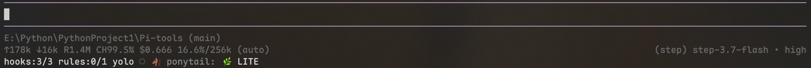

# pi-hooks-rules

A Pi 0.84.3+ package for Node.js 22.19+ that provides:

- `/hooks` interactive management and command-line actions.
- Global and trusted-project hook configuration.
- Node-based pre-tool blocking and post-tool validation hooks.
- Per-session hook status, tests, and recent-run inspection.
- Automatic injection of user and trusted-project Markdown rules.

## Install

```bash
pi install npm:@dianel/pi-hooks-rules
```

Restart Pi or run `/reload`, then open `/hooks`.

## Commands

```text
/hooks
/hooks list
/hooks show <id>
/hooks add
/hooks enable|disable|toggle <id>
/hooks remove <id>
/hooks test <id>
/hooks logs [id]
/hooks reload
```

## Demo

The `/hooks` interface:



## Hook configuration

Hooks are configured as JSON and run around Pi tool calls. The package ships Node-only defaults in [`hooks.json`](./hooks.json).

### Configuration files

| Scope | Path | Loading and priority |
|-------|------|----------------------|
| Bundled | Installed package `hooks.json` | Always loaded first; supplies the built-in hooks |
| Global | `~/.pi/agent/hooks-rules.json` | Optional; loaded after bundled defaults |
| Project | `.pi/hooks-rules.json` | Optional; loaded only when the project is trusted and has a Pi trust marker |

The merge order is **bundled → global → project**. A later definition with the same `id` replaces the complete earlier definition; fields are not merged. An `overrides` entry changes only `enabled`, which lets you disable a bundled hook without copying its command or matcher. Unknown override IDs and invalid JSON stop hook loading and are reported by `/hooks reload`.

Do not edit the installed `hooks.json`: package upgrades replace it. Put personal defaults in the global file and project policy in the project file.

### File format

```json
{
  "version": 1,
  "hooks": [
    {
      "id": "protect-sensitive-files",
      "event": "tool_call",
      "tools": ["write", "edit"],
      "command": "${node}",
      "args": ["${configDir}/hooks/protect-sensitive-files.mjs"],
      "timeoutMs": 5000,
      "enabled": true
    }
  ],
  "overrides": {}
}
```

| Field | Required | Rules |
|-------|----------|-------|
| `version` | yes | Must be the number `1`. |
| `hooks` | yes | Array of hook definitions. IDs must be unique within one file. |
| `overrides` | no | Object of `{ "hook-id": { "enabled": boolean } }`; defaults to `{}`. |
| `id` | yes | Non-empty; matches `[a-z0-9._-]+` (case-insensitive). |
| `event` | yes | Exactly `tool_call` or `tool_result`. |
| `tools` | yes | Non-empty string array; matching is case-insensitive. Use `"*"` for every tool. |
| `command` | yes | One executable name or path, without newlines. |
| `args` | no | String array; each item is passed as one argument. Defaults to `[]`. |
| `timeoutMs` | no | Integer from `100` to `120000`; defaults to `5000`. |
| `enabled` | no | Boolean; defaults to `true`. |

### Selecting an event

| Event | Runs | Failure behavior | Use it for |
|-------|------|------------------|------------|
| `tool_call` | Before the selected tool executes | A denial or non-zero exit blocks the tool call | Secret checks, destructive-operation guards, policy gates |
| `tool_result` | After the selected tool returns | A non-zero exit marks the result as failed and adds the hook error to the result; it cannot undo the tool | Syntax checks, formatters, result validation, diagnostics |

A `tool_call` payload has `tool_name` and `tool_input`. A `tool_result` payload also has `tool_response` and `tool_error`. Choose `tool_call` when prevention matters; choose `tool_result` when the tool must run before validation.

### Selecting tools

`tools` contains exact Pi tool names, not regular expressions. Names are normalized to lowercase, so `Bash` and `bash` match the same tool. `"*"` is the only wildcard and matches every tool; values such as `"bash*"` do not perform prefix matching.

Common tool groups are:

- **Command tools:** `bash`, `powershell`
- **File tools:** `read`, `write`, `edit`
- **Search and other tools:** `grep`, `find`, `ls`, or the exact name of a custom Pi tool

The package does not impose a fixed allow-list. A hook can match any tool name emitted by Pi, but a narrow list is safer than `"*"` for policy hooks.

### Command types and placeholders

Hooks are started as `spawn(command, args)`; the command is **not** passed through a shell. Keep the executable in `command` and pass every argument as a separate `args` item.

| Type | Example | Notes |
|------|---------|-------|
| Node script (recommended) | `"command": "${node}"` | `${node}` resolves to the current Node executable. Put the script path in `args`. |
| Bash script | `"command": "bash"` | Use `args: ["${configDir}/hooks/check.sh"]`; Bash must be available. |
| PowerShell script | `"command": "powershell"` | Use `args: ["-NoProfile", "-File", "${configDir}/hooks/check.ps1"]`. |
| Direct executable | `"command": "git-check"` | The executable must be on `PATH`, or use an absolute path. |

If a command contains a path separator and is relative, it is resolved relative to the configuration file directory. The following placeholders are available in `command` and every `args` value:

| Placeholder | Resolves to |
|-------------|-------------|
| `${node}` | Current Node executable (`process.execPath`) |
| `${hooksDir}` | Installed package `hooks/` directory |
| `${agentDir}` | Pi global agent directory |
| `${configDir}` | Directory containing this configuration file |
| `${cwd}` | Current project working directory |

For example, a project hook can be stored at `.pi/hooks/check.mjs` and invoked with `${configDir}/hooks/check.mjs`; a global hook uses the same form relative to `~/.pi/agent`. Shell operators such as `&&`, `|`, and `>` are not interpreted unless you explicitly invoke a shell.

### Hook input and output

Each hook receives one JSON document on **stdin**. Typical input looks like this:

```json
{
  "tool_name": "Write",
  "tool_input": {
    "path": "src/app.ts",
    "content": "..."
  },
  "tool_response": [],
  "tool_error": false
}
```

`tool_response` and `tool_error` are present for `tool_result` hooks. For convenience, the package also exposes `path` as `file_path`; for `Edit`, its `edits[].oldText` and `edits[].newText` are joined as `old_string` and `new_string`. The original tool input remains available.

A hook should write diagnostics to stderr and, when returning a decision, write JSON to stdout. The standard blocking response for a `tool_call` hook is:

```json
{
  "hookSpecificOutput": {
    "hookEventName": "PreToolUse",
    "permissionDecision": "deny",
    "permissionDecisionReason": "Explain the policy violation"
  },
  "systemMessage": "Short message for the user"
}
```

The plugin also accepts the legacy `{ "decision": "block", "reason": "..." }` shape. A valid denial blocks even with exit code `0`; any non-zero exit blocks `tool_call` hooks. A `tool_result` hook with a non-zero exit adds an error message to the returned result. Hook output is allowed to contain diagnostic lines before its final JSON result.

### Built-in hooks

| ID | Event | Tools | Default timeout | Purpose |
|----|-------|-------|-----------------|---------|
| `secret-guard` | `tool_call` | `bash`, `powershell`, `write`, `edit` | 5s | Blocks recognized API keys, tokens, private keys, and credential URLs. |
| `destructive-command-guard` | `tool_call` | `bash`, `powershell` | 5s | Blocks protected Git operations and unsafe recursive deletion; allows recognized disposable targets. |
| `syntax-format-check` | `tool_result` | `write`, `edit` | 10s | Checks JavaScript, JSON, shell, and Python syntax; runs local Prettier when available. |

Disable or re-enable a bundled hook with a minimal override:

```json
{
  "version": 1,
  "hooks": [],
  "overrides": {
    "secret-guard": { "enabled": false },
    "syntax-format-check": { "enabled": true }
  }
}
```

To change a bundled hook's command, event, or tools, define a complete replacement with the same ID at a higher-priority scope. Prefer a new ID for custom behavior so package upgrades remain safe.

### Standard workflow

1. **Choose the scope.** Use the global file for personal policy; use `.pi/hooks-rules.json` for a trusted project policy.
2. **Create the file.** Keep `version: 1`, use a unique ID, and start with the narrowest event and tool list.
3. **Choose the executable.** Prefer `${node}` plus a script path; pass arguments separately and set an explicit timeout for slow checks.
4. **Implement the hook.** Read one JSON document from stdin, write useful diagnostics to stderr, return a decision JSON only when needed, and exit non-zero on failure.
5. **Reload and inspect.** Run `/hooks reload`, then `/hooks list` and `/hooks show <id>`.
6. **Test both paths.** Run `/hooks test <id>` and exercise an allowed case and a blocked/failing case appropriate to the event.
7. **Review execution.** Use `/hooks logs [id]` to inspect status, exit code, and duration. Commit project configuration and hook scripts when the policy is shared.

## Rules

The package does not ship personal rules. Add Markdown files to either location:

- Global: `~/.pi/agent/rules/`
- Project: `.pi/rules/`

Rules without front matter load for every turn. Path-scoped rules use a `paths` front-matter list and are added after Pi reads, writes, or edits a matching path relative to the working directory. They are not added for unrelated paths:

```md
---
paths:
  - "xxx/**"
  - "**/xxx/**"
---
```

Project hooks and rules load only when the project also contains a Pi trust-triggering resource such as `.pi/settings.json`, `.pi/extensions/`, `.pi/skills/`, `.pi/prompts/`, `.pi/themes/`, `.pi/SYSTEM.md`, `.pi/APPEND_SYSTEM.md`, or project/ancestor `.agents/skills/`, and the project is trusted. This prevents a repository containing only hidden hook/rule files from bypassing Pi's trust prompt.

## Security

Pi extensions and configured hook commands execute with the user's permissions. Review package source and project configuration before granting trust or enabling third-party commands.
