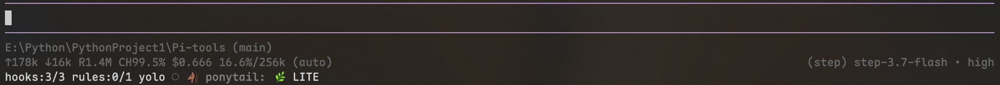

# pi-hooks-rules

A Pi 0.84.3+ package (compatible with Pi 1.0) for Node.js 22.19+ that provides:

- `/hooks` interactive management and command-line actions.
- Global and trusted-project hook configuration.
- Node-based pre-tool blocking and post-tool validation hooks.
- Lifecycle hooks for session start/shutdown, prompt input, user `!` commands, agent start, final settlement, and compaction.
- Per-session hook status, tests, and recent-run inspection.
- Automatic injection of user and trusted-project Markdown rules.

## Install

```bash
pi install npm:@dianel/pi-hooks-rules
```

Restart Pi or run `/reload`, then open `/hooks`.

## Commands

```text
/hooks
/hooks list
/hooks show <id>
/hooks add
/hooks enable|disable|toggle <id>
/hooks remove <id>
/hooks test <id>
/hooks logs [id]
/hooks reload
```

## Demo

The `/hooks` interface:



## Hook configuration

Hooks are configured as JSON and run around Pi tool calls and lifecycle events. The package ships Node-only defaults in [`hooks.json`](./hooks.json).

### Configuration files

| Scope | Path | Loading and priority |
|-------|------|----------------------|
| Bundled | Installed package `hooks.json` | Always loaded first; supplies the built-in hooks |
| Global | `~/.pi/agent/hooks-rules.json` | Optional; loaded after bundled defaults |
| Project | `.pi/hooks-rules.json` | Optional; loaded only when the project is trusted and has a Pi trust marker |

The merge order is **bundled → global → project**. A later definition with the same `id` replaces the complete earlier definition; fields are not merged. An `overrides` entry changes only `enabled`, which lets you disable a bundled hook without copying its command or matcher. Unknown override IDs and invalid JSON stop hook loading and are reported by `/hooks reload`.

Do not edit the installed `hooks.json`: package upgrades replace it. Put personal defaults in the global file and project policy in the project file.

### File format

```json
{
  "version": 1,
  "hooks": [
    {
      "id": "protect-sensitive-files",
      "event": "tool_call",
      "tools": ["write", "edit"],
      "command": "${node}",
      "args": ["${configDir}/hooks/protect-sensitive-files.mjs"],
      "timeoutMs": 5000,
      "enabled": true
    }
  ],
  "overrides": {}
}
```

| Field | Required | Rules |
|-------|----------|-------|
| `version` | yes | Must be the number `1`. |
| `hooks` | yes | Array of hook definitions. IDs must be unique within one file. |
| `overrides` | no | Object of `{ "hook-id": { "enabled": boolean } }`; defaults to `{}`. |
| `id` | yes | Non-empty; matches `[a-z0-9._-]+` (case-insensitive). |
| `event` | yes | A tool event from [Selecting an event](#selecting-an-event) or a lifecycle event from [Lifecycle events](#lifecycle-events). |
| `tools` | tool events only | Required for `tool_call` and `tool_result`: non-empty string array; matching is case-insensitive. Use `"*"` for every tool. Omit it for lifecycle events. |
| `command` | yes | One executable name or path, without newlines. |
| `args` | no | String array; each item is passed as one argument. Defaults to `[]`. |
| `timeoutMs` | no | Integer from `100` to `120000`; defaults to `5000`. |
| `enabled` | no | Boolean; defaults to `true`. |

### Selecting an event

| Event | Runs | Failure behavior | Use it for |
|-------|------|------------------|------------|
| `tool_call` | Before the selected tool executes | A denial or non-zero exit blocks the tool call | Secret checks, destructive-operation guards, policy gates |
| `tool_result` | After the selected tool returns | A non-zero exit marks the result as failed and adds the hook error to the result; it cannot undo the tool. The tool's `structuredContent` is kept, so codemode scripts still receive the original structured result | Syntax checks, formatters, result validation, diagnostics |

A `tool_call` payload has `tool_name` and `tool_input`. A `tool_result` payload also has `tool_response` and `tool_error`. Choose `tool_call` when prevention matters; choose `tool_result` when the tool must run before validation.

### Lifecycle events

Lifecycle hooks run for every occurrence of their event; they have no `tools` selector. Their payload always contains `hook_event_name`, `cwd`, `session_id`, and `transcript_path`, plus the fields below. A "denial" is the same decision JSON used by `tool_call` hooks.

| Event | Extra payload fields | Denial | Non-zero exit | Use it for |
|-------|----------------------|--------|---------------|------------|
| `session_start` | `reason` (`startup`, `reload`, `new`, `resume`, `fork`), `previous_session_file` | Ignored | Warning | Environment checks, session context |
| `input` | `prompt`, `source`, `streaming_behavior`, `image_count` | Drops the prompt and shows the reason | Drops the prompt | Prompt policy |
| `user_bash` | `tool_name: "Bash"`, `tool_input.command`, `exclude_from_context` | Blocks the `!`/`!!` command and records the reason as its output | Blocks the command | Reusing command guards for user shell commands |
| `before_agent_start` | `prompt` | Ignored | Warning | Per-run context |
| `agent_before_settle` | `outcome`, `stop_hook_active` | Continues the run with the reason as the next instruction | Warning; the run finishes | Stop checks such as "tests still fail" |
| `session_before_compact` | `reason` (`manual`, `threshold`, `overflow`), `will_retry`, `custom_instructions` | Cancels compaction | Warning; compaction continues | Preserving full history |
| `session_shutdown` | `reason` (`quit`, `reload`, `new`, `resume`, `fork`), `target_session_file` | Ignored | Warning | Cleanup, notifications |

- **Context injection.** A successful `session_start` or `before_agent_start` hook can print `{ "hookSpecificOutput": { "additionalContext": "..." } }`. The text is added to the next run as a hidden context message: `session_start` context once, `before_agent_start` context on every run.
- **Settle continuations.** `agent_before_settle` hooks run only for runs that completed normally, never for aborted or failed ones. A denial must include a non-empty reason; it is shown in the transcript and sent to the model. One run can be continued at most 3 times; `stop_hook_active` is `true` after the first continuation so a hook can avoid repeating itself.
- **Compaction.** Cancelling an `overflow` compaction also stops the overflow retry. A failing compaction hook never cancels compaction.
- **Shutdown.** `session_shutdown` hooks run while Pi is exiting or replacing the session; keep them short.

### Lifecycle examples

The configuration below goes in `~/.pi/agent/hooks-rules.json` or a trusted project's `.pi/hooks-rules.json`; the scripts go in a `hooks/` directory next to it. Use only the entries you need.

```json
{
  "version": 1,
  "hooks": [
    {
      "id": "user-bash-destructive-guard",
      "event": "user_bash",
      "command": "${node}",
      "args": ["${hooksDir}/destructive-command-guard.mjs"]
    },
    {
      "id": "user-bash-secret-guard",
      "event": "user_bash",
      "command": "${node}",
      "args": ["${hooksDir}/secret-guard.mjs"]
    },
    {
      "id": "git-branch-context",
      "event": "session_start",
      "command": "${node}",
      "args": ["${configDir}/hooks/git-branch-context.mjs"]
    },
    {
      "id": "prompt-private-key-guard",
      "event": "input",
      "command": "${node}",
      "args": ["${configDir}/hooks/prompt-private-key-guard.mjs"]
    },
    {
      "id": "tests-before-finish",
      "event": "agent_before_settle",
      "command": "${node}",
      "args": ["${configDir}/hooks/tests-before-finish.mjs"],
      "timeoutMs": 120000
    },
    {
      "id": "manual-compaction-only",
      "event": "session_before_compact",
      "command": "${node}",
      "args": ["${configDir}/hooks/manual-compaction-only.mjs"]
    },
    {
      "id": "session-log",
      "event": "session_shutdown",
      "command": "${node}",
      "args": ["${configDir}/hooks/session-log.mjs", "${configDir}/session-log.txt"],
      "timeoutMs": 1000
    }
  ]
}
```

`user_bash` payloads use the Bash `tool_call` shape, so the bundled guards also check `!` and `!!` commands without changes.

`hooks/git-branch-context.mjs` adds the current branch to the first run of each session. The same output works for `before_agent_start`, which adds it to every run:

```js
import { execFileSync } from "node:child_process";

let raw = "";
for await (const chunk of process.stdin) raw += chunk;
const { cwd } = JSON.parse(raw);

let branch;
try {
  branch = execFileSync("git", ["branch", "--show-current"], {
    cwd,
    encoding: "utf8",
    stdio: ["ignore", "pipe", "ignore"],
  }).trim();
} catch {
  process.exit(0); // Not a Git repository: add no context.
}
process.stdout.write(JSON.stringify({
  hookSpecificOutput: { additionalContext: `Current Git branch: ${branch || "(detached HEAD)"}` },
}));
```

`hooks/prompt-private-key-guard.mjs` drops a prompt that contains a private key:

```js
let raw = "";
for await (const chunk of process.stdin) raw += chunk;
const { prompt } = JSON.parse(raw);

if (/-----BEGIN [A-Z ]*PRIVATE KEY-----/.test(prompt)) {
  process.stdout.write(JSON.stringify({
    decision: "block",
    reason: "The prompt contains a private key. Remove it and refer to the key file path instead.",
  }));
}
```

`hooks/tests-before-finish.mjs` keeps the agent working while `npm test` fails. Its reason, including the end of the test output, becomes the model's next instruction; the plugin stops after 3 continuations. A hook that times out is reported as a failure and lets the run finish:

```js
import { spawnSync } from "node:child_process";

let raw = "";
for await (const chunk of process.stdin) raw += chunk;
const { cwd } = JSON.parse(raw);

const result = spawnSync("npm test", { cwd, shell: true, encoding: "utf8" });
if (result.status !== 0) {
  const output = `${result.stdout ?? ""}${result.stderr ?? ""}`.trim().slice(-2000);
  process.stdout.write(JSON.stringify({
    decision: "block",
    reason: `npm test failed. Fix the failures before finishing.\n${output}`,
  }));
}
```

`hooks/manual-compaction-only.mjs` cancels automatic threshold compaction but allows `/compact` and overflow recovery:

```js
let raw = "";
for await (const chunk of process.stdin) raw += chunk;
const { reason } = JSON.parse(raw);

if (reason === "threshold") {
  process.stdout.write(JSON.stringify({
    decision: "block",
    reason: "Automatic compaction is disabled; run /compact when needed.",
  }));
}
```

`hooks/session-log.mjs` appends one line per session end to the file passed as its first argument:

```js
import { appendFileSync } from "node:fs";

let raw = "";
for await (const chunk of process.stdin) raw += chunk;
const { reason, session_id } = JSON.parse(raw);

appendFileSync(process.argv[2], `${new Date().toISOString()} ${reason} ${session_id ?? "-"}\n`);
```

### Selecting tools

`tools` contains exact Pi tool names, not regular expressions. Names are normalized to lowercase, so `Bash` and `bash` match the same tool. `"*"` is the only wildcard and matches every tool; values such as `"bash*"` do not perform prefix matching.

Common tool groups are:

- **Command tools:** `bash`, `powershell`, `cmd`
- **File tools:** `read`, `write`, `edit`
- **Search and other tools:** `grep`, `find`, `ls`, or the exact name of a custom Pi tool

The package does not impose a fixed allow-list. A hook can match any tool name emitted by Pi, but a narrow list is safer than `"*"` for policy hooks.

### Command types and placeholders

Hooks are started as `spawn(command, args)`; the command is **not** passed through a shell. Keep the executable in `command` and pass every argument as a separate `args` item.

| Type | Example | Notes |
|------|---------|-------|
| Node script (recommended) | `"command": "${node}"` | `${node}` resolves to the current Node executable. Put the script path in `args`. |
| Bash script | `"command": "bash"` | Use `args: ["${configDir}/hooks/check.sh"]`; Bash must be available. |
| PowerShell script | `"command": "powershell"` | Use `args: ["-NoProfile", "-File", "${configDir}/hooks/check.ps1"]`. |
| Direct executable | `"command": "git-check"` | The executable must be on `PATH`, or use an absolute path. |

If a command contains a path separator and is relative, it is resolved relative to the configuration file directory. The following placeholders are available in `command` and every `args` value:

| Placeholder | Resolves to |
|-------------|-------------|
| `${node}` | Current Node executable (`process.execPath`) |
| `${hooksDir}` | Installed package `hooks/` directory |
| `${agentDir}` | Pi global agent directory |
| `${configDir}` | Directory containing this configuration file |
| `${cwd}` | Current project working directory |

For example, a project hook can be stored at `.pi/hooks/check.mjs` and invoked with `${configDir}/hooks/check.mjs`; a global hook uses the same form relative to `~/.pi/agent`. Shell operators such as `&&`, `|`, and `>` are not interpreted unless you explicitly invoke a shell.

### Hook input and output

Each hook receives one JSON document on **stdin**. Typical input looks like this:

```json
{
  "tool_name": "Write",
  "tool_input": {
    "path": "src/app.ts",
    "content": "..."
  },
  "tool_response": [],
  "tool_error": false
}
```

`tool_response` and `tool_error` are present for `tool_result` hooks. For convenience, the package also exposes `path` as `file_path`; for `Edit`, its `edits[].oldText` and `edits[].newText` are joined as `old_string` and `new_string`. The original tool input remains available.

A hook should write diagnostics to stderr and, when returning a decision, write JSON to stdout. The standard blocking response for a `tool_call` hook is:

```json
{
  "hookSpecificOutput": {
    "hookEventName": "PreToolUse",
    "permissionDecision": "deny",
    "permissionDecisionReason": "Explain the policy violation"
  },
  "systemMessage": "Short message for the user"
}
```

The plugin also accepts the legacy `{ "decision": "block", "reason": "..." }` shape. A valid denial blocks even with exit code `0` or an empty reason; any non-zero exit blocks `tool_call` hooks. A `tool_result` hook with a non-zero exit adds an error message to the returned result. Hook output is allowed to contain diagnostic lines before its final JSON result.

### Built-in hooks

| ID | Event | Tools | Default timeout | Purpose |
|----|-------|-------|-----------------|---------|
| `secret-guard` | `tool_call` | `bash`, `powershell`, `write`, `edit` | 5s | Blocks recognized API keys, tokens, private keys, and credential URLs. |
| `destructive-command-guard` | `tool_call` | `bash`, `powershell`, `cmd` | 5s | Best-effort guard for recognized destructive Git operations and unsafe recursive deletion; allows recognized disposable targets. |
| `syntax-format-check` | `tool_result` | `write`, `edit` | 10s | Checks JavaScript, JSON, shell, and Python syntax; runs local Prettier when available. |

The destructive guard is a best-effort accident guard, not a security boundary. It blocks only recognized destructive Git operations and explicit recursive deletion whose targets are not known disposable artifacts. Unknown commands, and dynamic commands or arguments that are not part of a recognized recursive deletion, pass through; unsupported shell syntax, external scripts, and parser uncertainty also pass through. The Git checks cover common forms such as forced push, `reset --hard`, forced `clean`, checkout/restore of `.`, branch deletion, and stash drop/clear; Git preview forms such as `clean -n` and `push --dry-run` are allowed. Literal shell wrappers and command substitutions are inspected when their contents can be read. PowerShell `-WhatIf` and non-recursive deletion are not blocked. Cmd control-flow bodies are not inspected; when a Bash command declares multiple pending heredocs, the guard skips the remaining source instead of interpreting it.

Disable or re-enable a bundled hook with a minimal override:

```json
{
  "version": 1,
  "hooks": [],
  "overrides": {
    "secret-guard": { "enabled": false },
    "syntax-format-check": { "enabled": true }
  }
}
```

To change a bundled hook's command, event, or tools, define a complete replacement with the same ID at a higher-priority scope. Prefer a new ID for custom behavior so package upgrades remain safe.

### Standard workflow

1. **Choose the scope.** Use the global file for personal policy; use `.pi/hooks-rules.json` for a trusted project policy.
2. **Create the file.** Keep `version: 1`, use a unique ID, and start with the narrowest event and tool list.
3. **Choose the executable.** Prefer `${node}` plus a script path; pass arguments separately and set an explicit timeout for slow checks.
4. **Implement the hook.** Read one JSON document from stdin, write useful diagnostics to stderr, return a decision JSON only when needed, and exit non-zero on failure.
5. **Reload and inspect.** Run `/hooks reload`, then `/hooks list` and `/hooks show <id>`.
6. **Test both paths.** Run `/hooks test <id>` and exercise an allowed case and a blocked/failing case appropriate to the event.
7. **Review execution.** Use `/hooks logs [id]` to inspect status, exit code, and duration. Commit project configuration and hook scripts when the policy is shared.

## Rules

The package does not ship personal rules. Add Markdown files to either location:

- Global: `~/.pi/agent/rules/`
- Project: `.pi/rules/`

Rules without front matter load at the start of each agent turn. On Pi 1.0 they are added as the `auto_loaded_rules` system prompt section, so the rest of Pi's structured prompt and other extensions' prompt changes stay intact; hosts without prompt sections receive them appended to the system prompt. If an extension that runs earlier replaces the whole system prompt (returns `systemPrompt`), the rules are appended to that replacement instead. An extension that replaces the whole prompt after this one runs overrides the rules for that turn; Pi provides no way to combine the two, so load such extensions before this package. Path-scoped rules are **not loaded at session startup**: they are added after Pi reads, writes, or edits a matching path. Matching checks the path relative to the working directory and its ancestors, so a rule such as `openspec/**` also works when Pi starts inside the `openspec/` directory. Shell commands do not trigger path-scoped injection; the path must be accessed through `read`, `write`, or `edit`. Unmatched paths do not inject a rule:

```md
---
paths:
  - "xxx/**"
  - "**/xxx/**"
---
```

Project hooks and rules load only when the project also contains a Pi trust-triggering resource and the project is trusted. The check uses Pi's own trust detection, so it follows the running Pi version; on Pi 1.0 the resources are `.pi/settings.json`, `.pi/mcp.json`, `.pi/extensions/`, `.pi/skills/`, `.pi/prompts/`, `.pi/themes/`, `.pi/SYSTEM.md`, `.pi/APPEND_SYSTEM.md`, or project/ancestor `.agents/skills/`. This prevents a repository containing only hidden hook/rule files from bypassing Pi's trust prompt.

## Security

Pi extensions and configured hook commands execute with the user's permissions. Review package source and project configuration before granting trust or enabling third-party commands.
