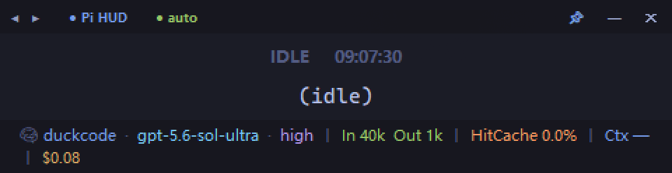
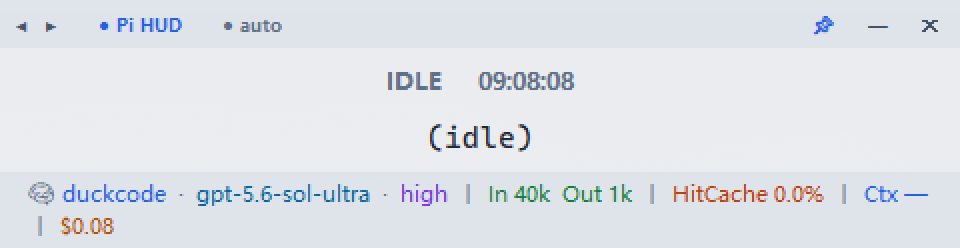
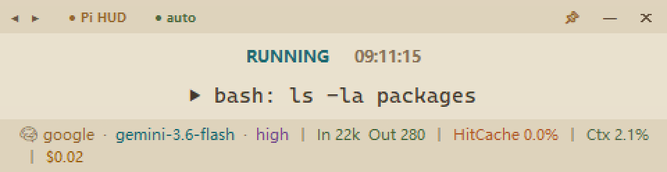

# Pi Task Monitor

Always-on-top real-time task monitor for [Pi](https://github.com/earendil-works/pi-coding-agent).

## Preview

```
┌───────────────────────────────────────────────────────────────────────┐
│ ◀ ▶ ● Pi Task Monitor  1/N                                📌  —  ✕   │
├───────────────────────────────────────────────────────────────────────┤
│                               RUNNING                                 │
│                   ▶ edit relative/path/to/file.py                     │
├───────────────────────────────────────────────────────────────────────┤
│ 🧠 OpenRouter 🔒  ·  claude-opus  ·  high  │  In 801  Out 875  │ ...  │
└───────────────────────────────────────────────────────────────────────┘
```

## Install

```bash
pi install npm:@dianel/pi-hud
```

After installation, restart Pi. The monitor window appears in the top-left corner.

## Features

- **Multi-session aware** — switches between multiple Pi terminal sessions
- **Reload-safe** — `/settings reload` or Pi restart automatically refreshes the HUD
- **OAuth indicator** — 🔒 shown when the current provider has valid login credentials
- **Session navigation** — ◀ ▶ buttons or keyboard shortcuts to browse sessions
- **Responsive layout** — footer switches between one and two rows; horizontal resizing preserves the current UI scale, while vertical resizing keeps status and command content centered
- **Context visibility** — resolves the active model's context window from Pi's custom and built-in model catalogs
- **Task activity** — shows a colored, enlarged, shaking bell while Pi is running
- **Subagent cost** — keeps Pi's session total aligned with the native footer and shows recognized subagent-tool cost as a separate breakdown

## Shortcuts

| Shortcut | Action |
| ---------- | -------- |
| Drag title bar | Move window |
| Drag edges / corners | Resize; horizontal dragging preserves the current UI scale |
| ◀ / `Ctrl+[` | Previous session |
| ▶ / `Ctrl+]` | Next session |
| Session label | Click to toggle auto-follow mode |
| Ctrl+T | Toggle always-on-top |
| Ctrl+A | Toggle transparency |
| Ctrl+H | Minimize window |
| Ctrl+Q | Quit |

### Session display

| Label | Meaning |
|-------|---------|
| `● auto` | Auto-following latest active session |
| `1/N` | Manually viewing session (N = running Pi terminals) |

### Responsive behavior

- The footer uses one row when its content fits and two rows when it wraps; its icons stay aligned with the scaled text baseline.
- Long command text stays on one line so it cannot grow the panel's minimum height; the full command remains available in the Pi terminal.

### Footer fields

| Segment | Color | Description |
| --------- | ------- | ------------- |
| Provider 🔒 | Blue | Current LLM provider (🔒 = valid OAuth login) |
| Model | Cyan | Current model name |
| Thinking | Purple | Reasoning intensity |
| In / Out | Green | Token usage this turn |
| HitCache | Orange | Cache hit rate |
| Ctx | Blue | Latest turn token usage as a percentage of the active model's context window |
| Cost | Amber | Pi session total, with recognized subagent-tool cost shown as a separate breakdown |

### Status

- **RUNNING** — Pi is active and the latest tool call is visible
- **THINKING** — Pi is active without a visible tool call
- **IDLE** — Pi has settled and is waiting for input

## How It Works

The ESM extension registers Pi lifecycle hooks. On start it registers the current terminal and starts `pi_hud.py` only when the shared monitor is not already alive. The Python side tails the latest Pi session JSONL file and reads settings / models for live status, rendering a compact Tkinter overlay. Multiple Pi terminals share this one monitor process through a PID registry; it exits only after the last registered terminal is gone.

On reload, the Node extension reuses the existing monitor and only removes its own terminal registration, so another terminal cannot make the shared panel disappear.

### Context calculation

`Ctx` divides the latest assistant usage total by the active provider/model context window. The context window lookup order is:

1. `~/.pi/agent/models.json`, including `modelOverrides`
2. Pi's built-in `~/.pi/agent/models-store.json`
3. Package compatibility metadata for known runtime aliases

When an assistant usage record omits `totalTokens`, the HUD derives it from `input + output + cacheRead + cacheWrite`.

## Themes

Right-click the monitor and open **theme** to choose **Dark**, **White**, or **Paper Beige**. The selection is saved with the window geometry and restored on the next launch.







## Data sources

| Display | Source |
| --------- | -------- |
| Current command | Session JSONL — latest assistant toolCall |
| Provider / Model | Session JSONL — assistant message fields |
| Thinking level | Session JSONL — `thinking_level_change` event |
| Token usage | Session JSONL — assistant message usage |
| Main / subagent cost | Main-session usage, all tool-result usage, and compaction/branch-summary usage; recognized subagent-tool cost is shown separately |
| Activity status | Session JSONL — `agent_start` / `agent_settled` lifecycle events |
| OAuth status | `~/.pi/agent/auth.json` — provider credential expiry |
| Context window | `models.json` → `models-store.json` → compatibility metadata |

## Manual start (development)

```bash
python pi_hud.py
```

## License

MIT
