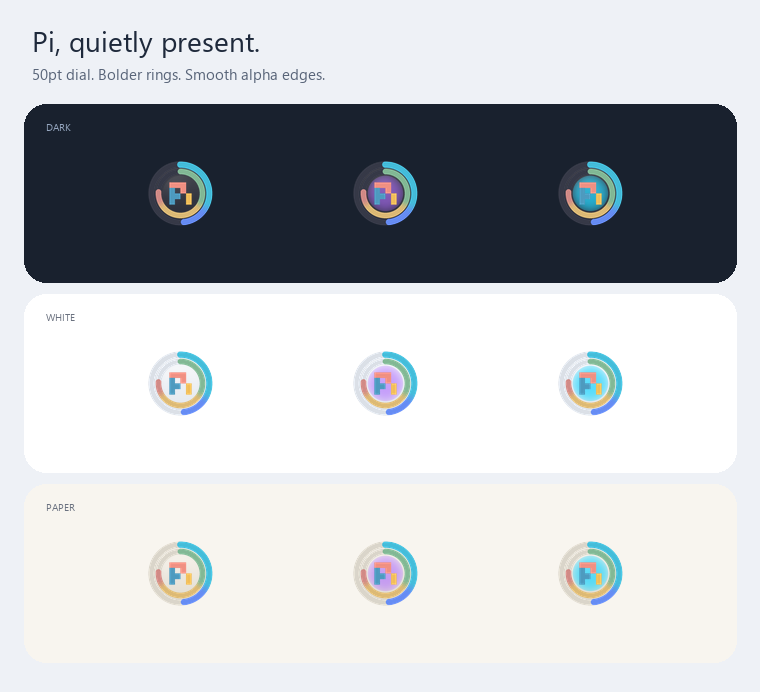
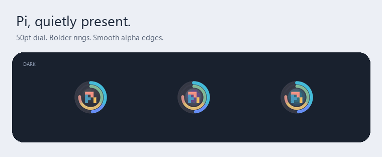
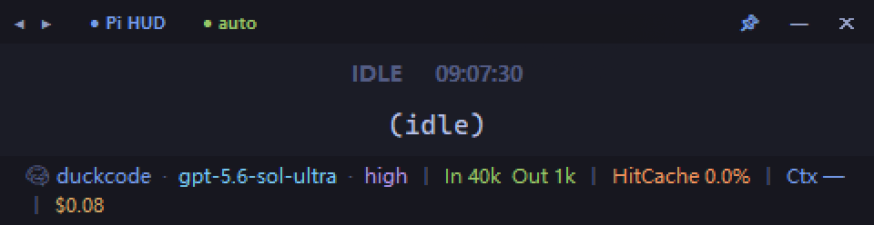
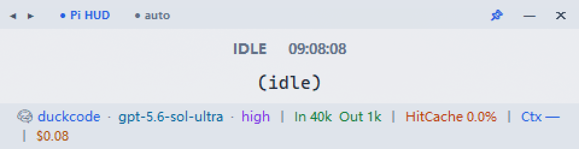
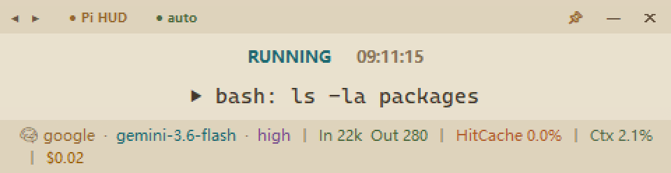

# Pi Task Monitor

Always-on-top real-time task monitor for [Pi](https://github.com/earendil-works/pi-coding-agent).

## Preview

```
┌───────────────────────────────────────────────────────────────────────┐
│ ◀ ▶ ● Pi Task Monitor  1/N                                📌  —  ✕   │
├───────────────────────────────────────────────────────────────────────┤
│                               RUNNING                                 │
│                   ▶ edit relative/path/to/file.py                     │
├───────────────────────────────────────────────────────────────────────┤
│ 🧠 provider-a 🔒  ·  claude-opus  ·  high  │  In 801  Out 875  │ ...  │
└───────────────────────────────────────────────────────────────────────┘
```

## Install

```bash
pi install npm:@dianel/pi-hud
```

After installation, restart Pi. The monitor window appears in the top-left corner when a Pi session starts. Compatible with Pi 1.0 and its default fullscreen TUI.

## Features

- **Multi-session aware** — switches between multiple Pi terminal sessions
- **Multi-monitor safe** — validates the saved window position against the current virtual desktop and recenters it when a monitor is disconnected or the layout changes
- **Provider-aware model display** — maps the model requested in the session to the matching model configured for that provider, with safe fallback to the runtime value
- **Reload-safe** — `/reload` or a Pi restart reuses the running HUD instead of opening a second window
- **OAuth indicator** — 🔒 shown when the current provider has valid login credentials
- **Session navigation** — ◀ ▶ buttons or keyboard shortcuts to browse sessions
- **Responsive layout** — footer switches between one and two rows; horizontal resizing preserves the current UI scale, while vertical resizing keeps status and command content centered
- **Context visibility** — resolves the active model's context window from Pi's custom and built-in model catalogs
- **Task activity** — shows a colored, enlarged, shaking bell while Pi is running
- **Circular dock** — right-click to switch to a compact Pi-logo circle; it stays where dropped and parks halfway off-screen only when released near an edge
- **Bilingual UI** — switches between Chinese and English from the right-click menu; the preference is persisted
- **Subagent cost** — keeps Pi's session total aligned with the native footer and shows recognized subagent-tool cost as a separate breakdown

## Shortcuts

| Shortcut | Action |
| ---------- | -------- |
| Drag title bar | Move window |
| Right-click | Open actions; switch between rectangle and circle |
| Drag edges / corners | Resize; horizontal dragging preserves the current UI scale |
| ◀ / `Ctrl+[` | Previous session |
| ▶ / `Ctrl+]` | Next session |
| Session label | Click to toggle auto-follow mode |
| Ctrl+T | Toggle always-on-top |
| Ctrl+A | Toggle transparency |
| Ctrl+H | Minimize window |
| Ctrl+Q | Quit |

### Session display

| Label | Meaning |
|-------|---------|
| `● auto` | Auto-following latest active session |
| `1/N` | Manually viewing session (N = running Pi terminals) |

### Responsive behavior

- The footer uses one row when its content fits and two rows when it wraps; its icons stay aligned with the scaled text baseline.
- Long command text stays on one line so it cannot grow the panel's minimum height; the full command remains available in the Pi terminal.

### Footer fields

| Segment | Color | Description |
| --------- | ------- | ------------- |
| Provider 🔒 | Blue | Current LLM provider (🔒 = valid OAuth login) |
| Model | Cyan | Current model name |
| Thinking | Purple | Reasoning intensity |
| In / Out | Green | Token usage this turn |
| HitCache | Orange | Cache hit rate |
| Ctx | Blue | Latest turn token usage as a percentage of the active model's context window |
| Cost | Amber | Pi session total, with recognized subagent-tool cost shown as a separate breakdown |

### Status

- **RUNNING** — Pi is active and the latest tool call is visible
- **THINKING** — Pi is active without a visible tool call
- **IDLE** — Pi has settled and is waiting for input

## How It Works

The ESM extension registers Pi lifecycle hooks. On `session_start` (startup, `/reload`, new, resume, or fork) it registers the current terminal and starts `pi_hud.py` only when the shared monitor is not already alive. The Python side tails the latest Pi session JSONL file and reads settings / models for live status, rendering a compact Tkinter overlay. Multiple Pi terminals share this one monitor process through a PID registry; it exits only after the last registered terminal is gone.

Loading the extension alone starts nothing, so Pi commands that load extensions without a session never open the monitor. On reload, the Node extension reuses the existing monitor and keeps one process exit hook, which removes only this terminal's registration when Pi exits, so another terminal cannot make the shared panel disappear.

Startup diagnostics are written to `~/.pi/pi-hud.log` (or `$PI_HUD_DIR/pi-hud.log`) instead of the terminal, so they cannot corrupt Pi's fullscreen display.

### Context calculation

`Ctx` divides the latest assistant usage total by the active provider/model context window. The displayed model is resolved within the active provider before the context window lookup. The context window lookup order is:

1. `~/.pi/agent/models.json`, including `modelOverrides`
2. Pi's built-in `~/.pi/agent/models-store.json`
3. Optional manual compatibility entries in `~/.pi/model_config.json`

### Manual model mapping

Automatic mapping is provider-scoped and uses the actual provider/model from the session. For runtime aliases that cannot be inferred automatically, create the optional `~/.pi/model_config.json`:

```json
{
  "mappings": {
    "provider-a": {
      "gpt-5.6-luna-max": "gpt-5.6-luna"
    }
  },
  "contextWindows": {
    "provider-a": {
      "gpt-5.6-luna-max": 272000
    }
  }
}
```

`mappings` and `contextWindows` are both keyed by provider and then the runtime model. A manual mapping takes precedence over automatic catalog mapping. The file is optional, ignored when missing or invalid, and is not included in the package.

## Themes

Right-click the monitor and open **Theme** to choose **Dark**, **White**, or **Paper Beige**. Open **Language / 语言** to switch between English and Chinese. The same menu switches between the rectangular monitor and the circular dock. Theme, language, shape and geometry preferences are saved and restored on the next launch.

The compact 50-point circle is divided into three visual layers: enlarged Pi logo, inner cache ring, and outer context ring. The context ring is the outermost layer. The rings are intentionally bold and close to the center, while the outer silhouette remains a clean circle. Window, image and docking geometry share the same DPI-scaled pixel size, so the circle is never cropped. Interior artwork is rendered at 6× resolution with native per-pixel alpha on Windows.

Two bold, closely spaced rings with rounded ends show progress against fixed thirds of capacity:

- **Outer — context**, a cool ramp of cyan → blue → purple
- **Inner — cache hit**, a warm ramp of green → amber → red

Each stage is mostly solid, with a short continuous gradient at its boundary. The rings and outer shell never breathe, rotate or change color with agent state.

Only the center light breathes brighter: purple for **THINKING**, cyan for **RUNNING**, and still for **IDLE**. The logo area has no extra status label. Hover adds an eased highlight; pressing gently dims the inset material. Static layers are cached independently of animation, with a 33ms frame timer only while active or settling. Right-click **motion_off** to disable breathing and transitions; this preference is saved.

It remains free-floating until its edge meets a screen edge, where it parks halfway off-screen; clicking the parked circle reveals or hides its full face. Hovering fades in a smaller, translucent rounded frosted summary with bold dark text beside the circle, without the current command. Both the orb and summary use antialiased per-pixel alpha on Windows to avoid jagged color-key edges. Minimizing or returning to the rectangle cancels orb animation and popup timers.

The frosted finish is locally rendered material, not native desktop backdrop blur. It never captures desktop content. On Windows, the orb and summary use a small native per-pixel alpha presenter; other platforms use the Tk color-key fallback. True desktop backdrop blur is intentionally not used.











## Data sources

| Display | Source |
| --------- | -------- |
| Current command | Session JSONL — latest assistant toolCall |
| Provider / Model | Session JSONL provides the actual provider/model request; the displayed model is normalized against that provider's `models.json` / `models-store.json` catalog |
| Thinking level | Session JSONL — `thinking_level_change` event |
| Token usage | Session JSONL — assistant message usage |
| Main / subagent cost | Main-session usage, all tool-result usage, compaction/branch-summary usage, and Pi 1.0 `usage` entries such as cache warming; recognized subagent-tool cost is shown separately |
| Activity status | Session JSONL — `agent_start` / `agent_settled` lifecycle events |
| OAuth status | `~/.pi/agent/auth.json` — provider credential expiry |
| Context window | `models.json` → `models-store.json` → `~/.pi/model_config.json` |

## Manual start (development)

```bash
python pi_hud.py
```

## License

MIT
