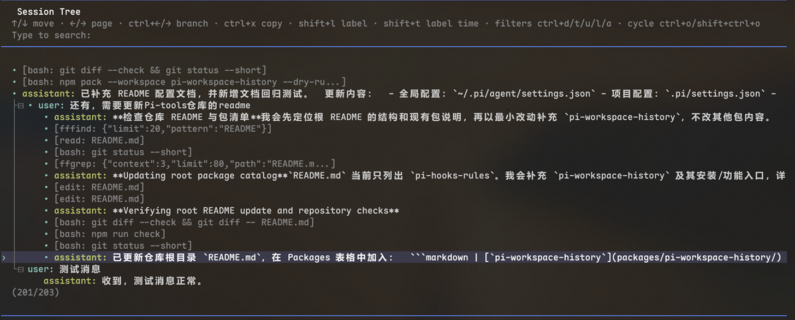

# Pi Workspace History

Based on [wcldyx/pi-workspace-history](https://github.com/wcldyx/pi-workspace-history).

Real workspace undo/redo for Pi. Tracks file snapshots around each agent turn so you can time-travel your workspace state.

## Install

```bash
pi install npm:@dianel/pi-workspace-history
```

## Commands

| Command | Description |
|---------|-------------|
| `/undo` | Restore workspace to before the last agent turn |
| `/redo` | Re-apply the last undone turn |
| `/checkpoint [label]` | Save a manual snapshot |
| `/rewind [entry-id]` | Browse history interactively or jump to a specific entry |

## How It Works

- A lightweight shadow git repo stores file snapshots committed around each turn.
- `before_agent_start` / `turn_start` snapshots the workspace before changes.
- `turn_end` commits the state after.
- `/undo` resets to the previous snapshot; `/redo` re-applies the undone turn.
- `/checkpoint` creates a named manual snapshot for bookmarks.
- `/rewind` opens a filterable history picker (↑↓ navigate, ⌃D/T/U/L/A cycle filters, ⌃X copy, ⇧L label, ⇧T time, ⌃←/→ branch).

## Shortcuts (in `/rewind` picker)

| Key | Action |
|-----|--------|
| ↑ / ↓ or j / k | Move selection |
| ← / → | Page up / down |
| Ctrl+← / Ctrl+→ | Branch |
| Ctrl+X | Copy selected entry text |
| Shift+L | Toggle label |
| Shift+T | Toggle time |
| Ctrl+D / T / U / L / A | Cycle filter mode |
| Enter | Confirm selection |
| Esc | Cancel |

## Preview

The `/rewind` picker:



## Configuration

Configure the plugin through Pi settings. Project settings override global settings.

- Global: `~/.pi/agent/settings.json`
- Project: `.pi/settings.json`

Example:

```json
{
  "workspaceHistory": {
    "storageDir": "D:\\pi-history",
    "maxSessionsPerWorkspace": 3,
    "maxWorkspaces": 10,
    "enabled": "auto",
    "allowHomeDirectory": false,
    "requireProjectMarker": true,
    "maxScanFiles": 20000,
    "maxScanDirs": 3000,
    "maxScanMs": 5000,
    "gitTimeoutMs": 60000,
    "excludePatterns": ["*.tmp", "scratch/", "data/large/"]
  }
}
```

| Setting | Default | Description |
|---------|---------|-------------|
| `workspaceHistory.storageDir` | `~/.pi/agent/state/workspace-history` | External storage root for shadow history |
| `workspaceHistory.maxSessionsPerWorkspace` | `3` | Keep only the most recently used sessions per workspace |
| `workspaceHistory.maxWorkspaces` | `10` | Keep only the most recently used workspaces globally |
| `workspaceHistory.enabled` | `"auto"` | `"auto"` disables the plugin outside project-like directories; `true` forces it on; `false` disables it completely |
| `workspaceHistory.allowHomeDirectory` | `false` | Allow the plugin to run in the user home directory |
| `workspaceHistory.requireProjectMarker` | `true` | Require a project marker such as `.git` or `package.json` |
| `workspaceHistory.maxScanFiles` | `20000` | Maximum number of files scanned when checking ignored/protected paths |
| `workspaceHistory.maxScanDirs` | `3000` | Maximum number of directories scanned when checking ignored/protected paths |
| `workspaceHistory.maxScanMs` | `5000` | Maximum time spent scanning ignored/protected paths, in milliseconds |
| `workspaceHistory.gitTimeoutMs` | `60000` | Timeout for internal Git operations, in milliseconds |
| `workspaceHistory.excludePatterns` | `[]` | Extra paths to exclude from snapshots, in `.gitignore` syntax. Appended to the built-in defaults; see below |

## Excluded Paths

The plugin never snapshots large, regenerable, non-source paths, so that time-travel stays fast and history stays small. This works even in a project with **no `.gitignore` and no Git repository at all** — the defaults are built in, not read from the project.

Built-in defaults: `.git`, `.pi/workspace-history`, `node_modules`, `dist`, `build`, `.cache`, `.next`, `.turbo`, `coverage`, `.env`, `.env.*`, `tmp`, `temp`, `logs`, `*.log`, `__pycache__`, `*.pyc`, `.venv`, `venv`, `.pytest_cache`, `.mypy_cache`, `.ruff_cache`, `.gradle`, `.idea`, `.DS_Store`.

If the project has a `.gitignore`, its rules are merged on top of the defaults. To exclude anything else, add `workspaceHistory.excludePatterns` (`.gitignore` syntax):

```json
{
  "workspaceHistory": {
    "excludePatterns": ["*.tmp", "scratch/", "data/large/"]
  }
}
```

Paths matched here are left untouched on disk during `/undo`, `/redo`, and `/rewind` — the plugin does not restore them, so use it only for files you are willing to keep as-is across a time-travel.

## Debug Logging

Logging is off by default. It is controlled by the `PI_WORKSPACE_HISTORY_LOG` **environment variable**. Accepted values are `1`, `true`, `yes`, and `on`.

```powershell
# PowerShell, before launching pi
$env:PI_WORKSPACE_HISTORY_LOG = "1"
pi
```

```bash
# bash / zsh
PI_WORKSPACE_HISTORY_LOG=1 pi
```

The log is written to `<storageDir>/logs/timemachine.log` — by default `~/.pi/agent/state/workspace-history/logs/timemachine.log`, or under `workspaceHistory.storageDir` when that is set.

It records snapshot commits, Git invocations with timings, restore and navigation outcomes, and how many paths each restore had to back up. That makes it the first thing to enable when a `/rewind`, `/undo`, or `/redo` behaves unexpectedly.

## Installation and Usage

Install from npm after publishing:

```bash
pi install npm:@dianel/pi-workspace-history
```

Or install from a local checkout:

```bash
pi install /path/to/workspace-history
```

After installing into an already-running Pi session, run `/reload`. Then test with:

```text
/rewind
/undo
/redo
/checkpoint test
```

## Local Development

The repository is configured for direct local extension loading:

```text
.pi/extensions/workspace-history.ts
.pi/settings.json
```

Start Pi in the repository directory, or run `/reload` after changing the extension.

## Testing

Run the complete check suite:

```bash
npm run check
```

Or run individual checks:

```bash
npm test
npm run typecheck
npm pack --workspace @dianel/pi-workspace-history --dry-run
```

## Recent Changes

- History is stored outside the workspace by default.
- Added `workspaceHistory.storageDir`.
- Added retention limits for sessions and workspaces.
- Reduced runtime overhead with cached settings/paths and throttled cleanup.

## Storage Layout

The plugin stores history outside the workspace by default:

```text
~/.pi/agent/state/workspace-history/
  workspaces/
    <workspaceHash>/
      meta.json
      sessions/
        <sessionId>/
          repo.git/
          redo.json
          turn-snapshots.json
          meta.json
  logs/
    timemachine.log
```

Notes:

- History is isolated from the user's project `.git` history.
- Old workspace-local `.pi/workspace-history/` state is not migrated automatically.
- Cleanup is LRU-style based on recent use.
- In `auto` mode, the plugin disables itself in broad directories such as the user home folder to avoid expensive scans and startup stalls.

## License

MIT
